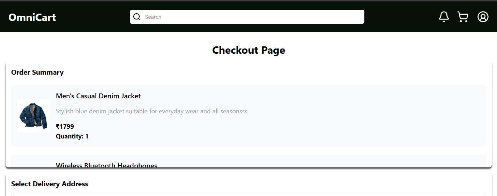
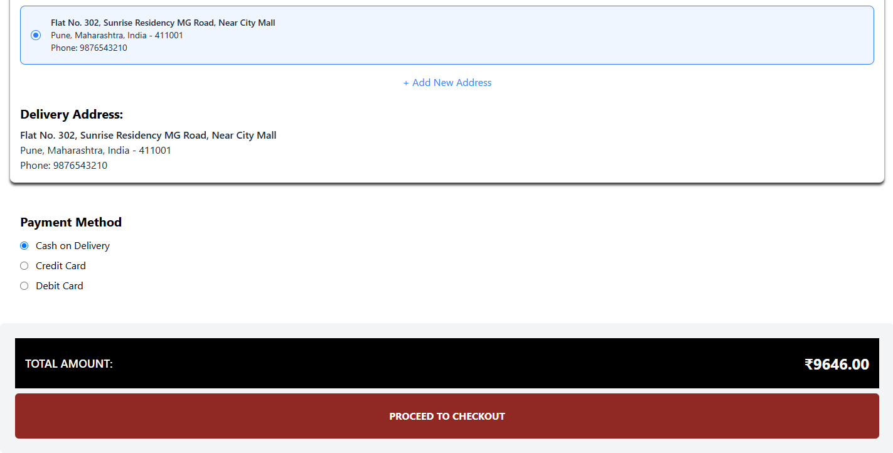
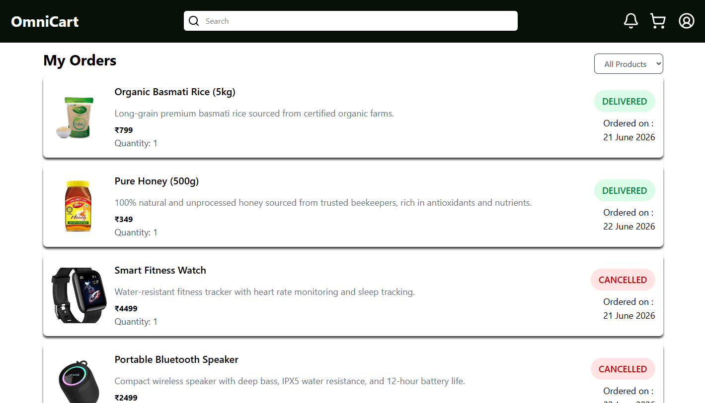

# OmniCart Frontend 🛒

***The frontend application for OmniCart, a modern MERN-based e-commerce platform built with React and Tailwind CSS. It provides an intuitive shopping experience with product browsing, secure authentication, cart management, checkout, and seamless integration with the OmniCart Backend API.***

# ✨ Features
```
- User Authentication
- Product Browsing
- Product Details
- Product Search
- Shopping Cart
- Buy Now
- Checkout
- Address Management
- Responsive Design
- Toast Notifications
- Dashboard Components
```

# 🖥️ User Interface

```
Home
Products
Product Details
Cart
Checkout
Profile
Orders
Login
Register
```

# 🔗 Backend Integration


> Axios is used to communicate with the OmniCart Backend through REST APIs.

*The frontend consumes REST APIs for:*

```
- Authentication
- Products
- Cart
- Checkout
- Orders
- User Profile
```

# ⚡ Routing

**Client-side routing is implemented using React Router DOM.**

*The application provides navigation between authentication,
shopping, cart, checkout, and user pages without requiring full page reloads.*

# 🎨 UI

```
- Tailwind CSS v4
- Responsive Layout
- Component-based architecture
- Lucide Icons
```

# 🔔 Notifications

***React Hot Toast provides lightweight toast notifications for:***

```
- Success
- Errors
- Warnings
- User feedback
```

# 🛠 Tech Stack
```
Frontend Framework
- React 19

Build Tool
- Vite

Styling
- Tailwind CSS v4

Routing
- React Router DOM

HTTP Client
- Axios

Notifications
- React Hot Toast

Icons
- Lucide React

Charts
- Recharts
```


# 💼 Getting Started

Prerequisites

- Before running the project, make sure you have the following installed:

```
- Node.js
- npm
```

# Step 1: Clone the Repository

> git clone https://github.com/CodeUserMartin/OmniCart-Frontend.git

```

- Navigate to the project directory:

- cd OmniCart-Frontend
```

# Step 2: Install Dependencies

Install all required packages:

> npm install

Ensure the backend server is running and the API URL matches your backend instance.

# Step 3: Start the Development Server

- Run the application in development mode:

> npm run dev

The application will be available at:

> http://localhost:5173


# Step 4: Open the Application


Open your browser and visit:

> http://localhost:5173

You can now explore the OmniCart frontend and interact with the backend APIs.

# 📷 Screenshots

### 🏠 Home Page

 


---

### 🛍️ Products


---

### 📦 Product Details


---

### 🛒 Shopping Cart


---

### 💳 Checkout





---

### 👤 Orders



# 🔮 Future Improvements

```
- Wishlist
- AI Chat Assistant
- Product Reviews
- Better Product Filtering
- Dark Mode
- Performance Optimization
- Lazy Loading
```

# 📱 Responsive Design

**The frontend is designed to provide a consistent user experience across desktops, tablets, and mobile devices using a responsive layout built with Tailwind CSS.**

---

# 👨‍💻 OmniCart

**OmniCart — A unified shopping experience built across products, sellers, carts, and orders.**

> **Backend:** : https://github.com/CodeUserMartin/OmniCart-Backend.git